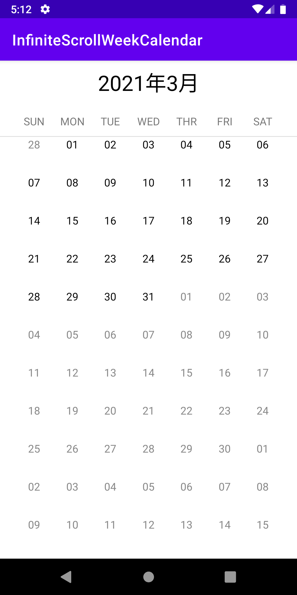

# VerticalCalendar Infinite scroll
Scroll calendar days infinitely in a vertical column in weekly view

[](https://github.com/emcthye/VerticalCalendar/blob/master/LICENSE)




## Installation

#### Import with Gradle:

```
dependencies {
    implementation 'com.github.Lipdroid:InfiniteScrollWeekCalendar:0.1.0'
}
```
## Basic Usage
```xml
<jp.co.infinitescrollweekcalendar.library.customViews.InfiniteScrollWeekCalendarView
        android:layout_width="match_parent"
        android:layout_height="match_parent" />
```
#### Initialize the calendar in oncreate:
```kotlin
InfiniteScrollWeekCalendarView(this)
```
### Month Change Scroll Listener
#### Implement the month change callback:
```kotlin
InfiniteScrollWeekCalendarView(this).setCurrentMonthCallbackListener(object : OnCurrentMonthChangeCallback{
            override fun onMonthChangedCallback(date: String) {
            //change the header text view when scroll to next month or previous month
            }
        })
```
